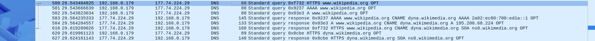

# Exercício 7 – Análise de Consulta DNS utilizando Wireshark
## Alunos - Ian Patrick, Maria Vieira, Miguel Moreira, Yago Brito
 
## Objetivo
 
Capturar e analisar o tráfego gerado por uma consulta DNS utilizando o software Wireshark, identificando o processo de resolução de nomes, os servidores envolvidos e os registros DNS retornados.
 
---
 
## Procedimento
 
1. O Wireshark foi aberto e a captura de pacotes foi iniciada na interface de rede ativa.
2. Foi acessado o site **www.wikipedia.org** através do navegador.
3. A captura foi interrompida após o carregamento completo da página.
4. Foi aplicado o filtro `dns` para exibir apenas os pacotes relacionados ao protocolo DNS.
---
 
## Figura 1 – Captura DNS no Wireshark
 

 
*Figura 1: Consultas e respostas DNS capturadas durante o acesso a www.wikipedia.org.*
 
---
 
## Endereços Identificados
 
| Papel | Endereço IP |
|---|---|
| Cliente (máquina local) | `192.168.0.179` |
| Servidor DNS | `177.74.224.29` |
 
O cliente (`192.168.0.179`) enviou todas as consultas DNS ao servidor `177.74.224.29`, que atuou como **resolver recursivo**, sendo responsável por obter as respostas e devolvê-las ao cliente.
 
---
 
## Consultas DNS Realizadas
 
Foram identificadas três tipos de consulta DNS para o domínio `www.wikipedia.org`:
 
| Tipo | Finalidade |
|---|---|
| **A** | Obter o endereço IPv4 do domínio |
| **AAAA** | Obter o endereço IPv6 do domínio |
| **HTTPS** | Verificar a existência de registro de serviço seguro (SVCB/HTTPS RR) |
 
> O navegador moderno realiza simultaneamente as consultas A, AAAA e HTTPS para otimizar o tempo de conexão, aproveitando o melhor protocolo e endereço disponíveis.
 
---
 
## Registros DNS Obtidos
 
### Registro CNAME (Canonical Name)
 
O domínio `www.wikipedia.org` não possui endereço próprio — ele aponta para um **alias**:
 
| Domínio Consultado | Alias (CNAME) |
|---|---|
| `www.wikipedia.org` | `dyna.wikimedia.org` |
 
O uso de CNAME permite que a Wikimedia gerencie centralmente a infraestrutura, aplicando balanceamento de carga e redundância sem alterar o domínio público.
 
---
 
### Registro A (IPv4)
 
| Domínio | Endereço IPv4 |
|---|---|
| `dyna.wikimedia.org` | `195.200.68.224` |
 
---
 
### Registro AAAA (IPv6)
 
| Domínio | Endereço IPv6 |
|---|---|
| `dyna.wikimedia.org` | `2a02:ec80:700:ed1a::1` |
 
---
 
### Registro HTTPS (SVCB)
 
Foi observada consulta do tipo **HTTPS RR** para `www.wikipedia.org` e posteriormente para `dyna.wikimedia.org`. Esse registro indica ao navegador que o serviço suporta conexões seguras e pode fornecer parâmetros adicionais de conexão (como suporte a HTTP/3).
 
---
 
### Registro SOA (Start of Authority)
 
| Domínio | Servidor Autoritativo |
|---|---|
| `dyna.wikimedia.org` | `ns0.wikimedia.org` |
 
O registro SOA identifica o servidor DNS **autoritativo** responsável pela zona `wikimedia.org`, ou seja, o servidor que possui as informações originais e definitivas sobre o domínio.
 
---
 
## Processo de Resolução de Nomes
 
O fluxo completo observado na captura foi:
 
1. O navegador precisou resolver `www.wikipedia.org` para estabelecer conexão.
2. O sistema operacional encaminhou a consulta ao servidor DNS configurado (`177.74.224.29`).
3. O servidor DNS respondeu com um registro **CNAME**, redirecionando para `dyna.wikimedia.org`.
4. Novas consultas foram realizadas para `dyna.wikimedia.org`, retornando:
   - Endereço **IPv4**: `195.200.68.224`
   - Endereço **IPv6**: `2a02:ec80:700:ed1a::1`
5. O registro **SOA** indicou `ns0.wikimedia.org` como servidor autoritativo do domínio.
6. Com os endereços resolvidos, o navegador estabeleceu a conexão com o servidor da Wikipédia via HTTPS.
---
 
## Análise dos Pacotes Capturados
 
| Nº Pacote | Tempo (s) | Tipo | Descrição |
|---|---|---|---|
| 580 | 29.543 | Query HTTPS | Consulta de registro HTTPS para `www.wikipedia.org` |
| 581 | 29.543 | Query AAAA | Consulta de endereço IPv6 para `www.wikipedia.org` |
| 582 | 29.543 | Query A | Consulta de endereço IPv4 para `www.wikipedia.org` |
| 584 | 29.564 | Response AAAA | Retornou CNAME → `dyna.wikimedia.org` → `2a02:ec80:700:ed1a::1` |
| 585 | 29.564 | Response A | Retornou CNAME → `dyna.wikimedia.org` → `195.200.68.224` |
| 616 | 29.619 | Query HTTPS | Nova consulta HTTPS para `www.wikipedia.org` |
| 620 | 29.619 | Query HTTPS | Consulta HTTPS para `dyna.wikimedia.org` |
| 627 | 29.624 | Response SOA | Retornou registro SOA: `ns0.wikimedia.org` |
 
---
 
## Conclusão
 
A captura realizada no Wireshark permitiu observar na prática o funcionamento do protocolo DNS. A análise evidenciou que, ao acessar `www.wikipedia.org`, o navegador realizou múltiplas consultas DNS simultâneas (A, AAAA e HTTPS), demonstrando o comportamento moderno de resolução paralela.
 
O uso de registro **CNAME** revelou que grandes organizações como a Wikimedia utilizam aliases para centralizar a gestão de infraestrutura, facilitando o balanceamento de carga e a manutenção. Os registros **SOA** identificaram o servidor autoritativo da zona, essencial para a hierarquia do sistema DNS.
 
Por fim, a presença de registros **AAAA** e **HTTPS RR** demonstra que a Wikimedia possui infraestrutura compatível com IPv6 e conexões seguras via HTTPS, refletindo boas práticas de segurança e modernização de redes.
 