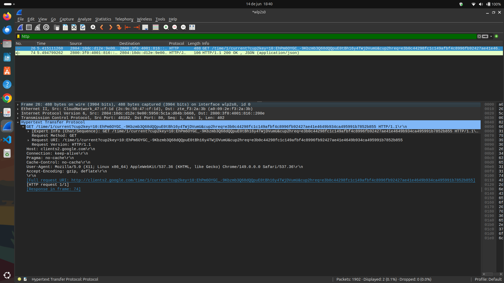
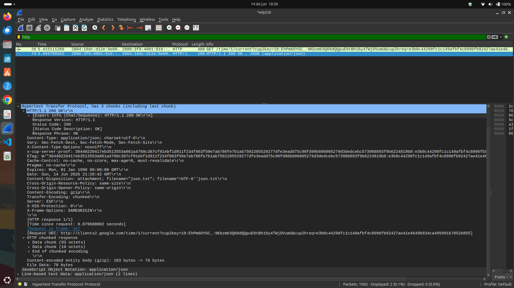

# Exercício 5 – Captura de Tráfego HTTP com Wireshark
## Alunos - Ian Patrick, Maria Vieira, Miguel Moreira, Yago Brito

## Imagem 1 – Pacote 26 (Requisição HTTP)



### Informações Identificadas

**Método:** GET

**URL acessada:**
```
http://clients2.google.com/time/1/current?cup2key=...
```

**Versão HTTP:** HTTP/1.1

**Porta de destino:** 80 (HTTP padrão)

**Cabeçalhos da Requisição identificados:**

| Cabeçalho | Valor |
|------------|--------|
| Host | clients2.google.com |
| Connection | keep-alive |
| Pragma | no-cache |
| Cache-Control | no-cache |
| User-Agent | Mozilla/5.0 (X11; Linux x86_64) Chrome/149.0.0.0 |
| Accept-Encoding | gzip, deflate |

---

## Imagem 2 – Pacote 74 (Resposta HTTP)



### Informações Identificadas

**Status:** 200 OK

**Versão HTTP:** HTTP/1.1

**Tempo de resposta:** aproximadamente 79 ms

### Cabeçalhos da Resposta identificados

| Cabeçalho | Valor |
|------------|--------|
| Content-Type | application/json; charset=utf-8 |
| Cache-Control | no-cache, no-store, max-age=0, must-revalidate |
| Content-Encoding | gzip |
| Transfer-Encoding | chunked |
| Date | Sun, 14 Jun 2026 21:20:42 GMT |
| Server | ESF |
| X-Frame-Options | SAMEORIGIN |
| Content-Disposition | attachment; filename="json.txt" |

### Conteúdo Retornado

O servidor retornou um arquivo no formato **JSON** (`application/json`).

- Tamanho comprimido: 103 bytes
- Tamanho após descompressão: 78 bytes

### Análise

A captura demonstra o funcionamento básico do protocolo HTTP:

1. O cliente envia uma requisição **GET** ao servidor.
2. A requisição utiliza a porta padrão HTTP (80).
3. O servidor responde com código **200 OK**, indicando sucesso.
4. O conteúdo retornado é um objeto JSON compactado com **gzip**.
5. O tempo de resposta observado foi de aproximadamente **79 ms**.

### Conclusão

A análise permitiu identificar os principais elementos de uma comunicação HTTP, incluindo método de requisição, URL acessada, cabeçalhos HTTP, código de status e conteúdo retornado pelo servidor. O Wireshark mostrou-se uma ferramenta eficiente para inspeção detalhada do tráfego de rede.