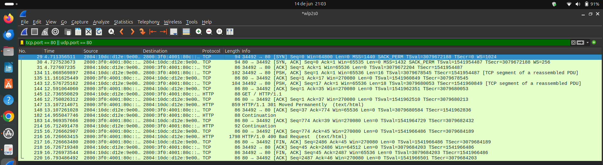
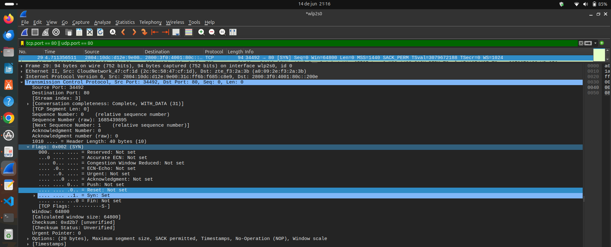
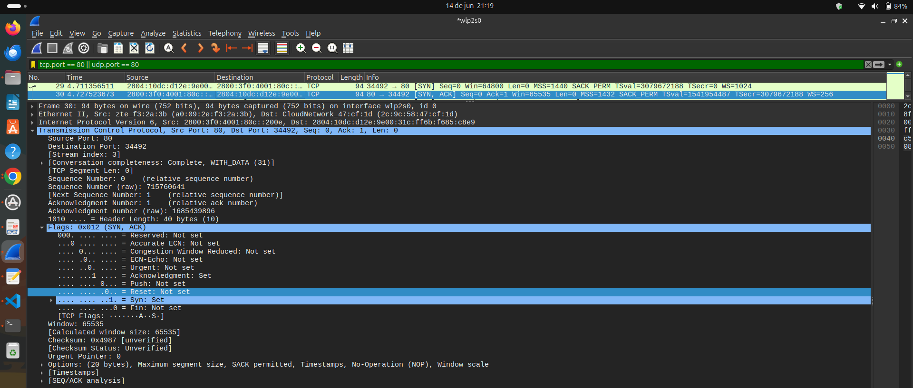
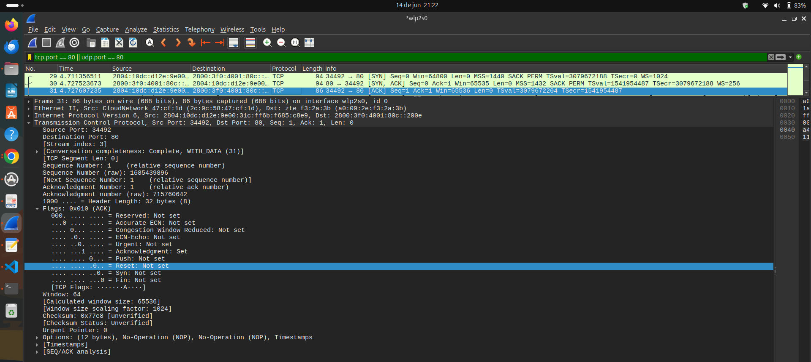
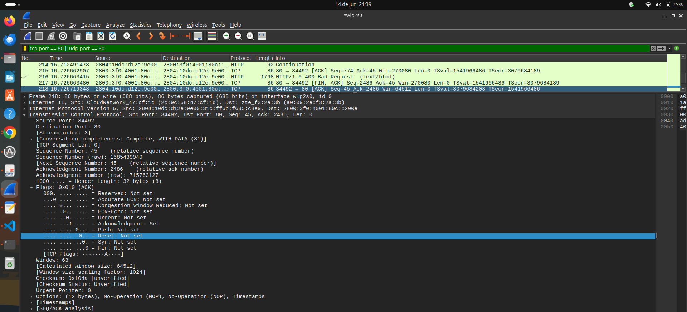
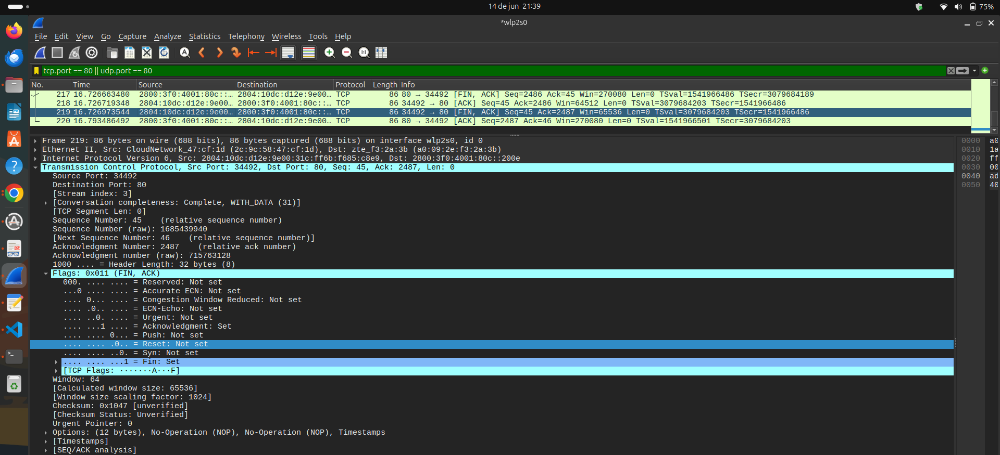
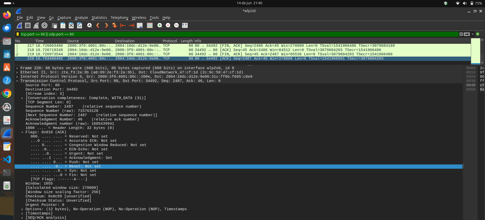

# Exercício 6 — Captura de Tráfego TCP com Wireshark

## Visão geral dos pacotes

---

## Estabelecimento da Conexão - 3 etapas

### Pacote 29 - SYN (Estabelecimento de conexão)

Informações observadas no cabeçalho TCP:

- Source Port: 34492
- Destination Port: 80
- Sequence Number: 0
- Acknowledgment Number: 0
- Flags: SYN
- Window Size: 64800

---

### Pacote 30 - SYN, ACK (Estabelecimento de conexão)

Informações observadas no cabeçalho TCP:

- Source Port: 80
- Destination Port: 34492
- Sequence Number: 0
- Acknowledgment Number: 1
- Flags: SYN, ACK
- Window Size: 65535

---

### Pacote 31 - ACK (Estabelecimento de conexão)

Informações observadas no cabeçalho TCP:

- Source Port: 34492
- Destination Port: 80
- Sequence Number: 0
- Acknowledgment Number: 1
- Flags: ACK
- Window Size: 65536

---

## Encerramento de conexão - 4 etapas

### Pacote 217 - FIN, ACK (Solicitação de Encerramento)

Informações observadas no cabeçalho TCP:

- Source Port: 80
- Destination Port: 34492
- Sequence Number: 2486
- Acknowledgment Number: 45
- Flags: FIN, ACK
- Window Size: 270080

---

### Pacote 218 - ACK (Confirmação)

Informações observadas no cabeçalho TCP:

- Source Port: 34492
- Destination Port: 80
- Sequence Number: 45
- Acknowledgment Number: 2486
- Flags: ACK
- Window Size: 64512

---

### Pacote 219 - FIN, ACK (Encerramento pelo Cliente)

Informações observadas no cabeçalho TCP:

- Source Port: 34492
- Destination Port: 80
- Sequence Number: 45
- Acknowledgment Number: 2487
- Flags: FIN, ACK
- Window Size: 65536

---

### Pacote 220 - ACK (Confirmação Final)

Informações observadas no cabeçalho TCP:

- Source Port: 80
- Destination Port: 34492
- Sequence Number: 2487
- Acknowledgment Number: 46
- Flags: ACK
- Window Size: 270080

---